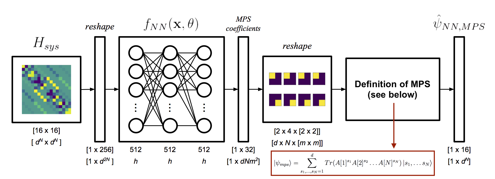

psi0nn: a neural network quantum ground state solver
=======
**[Sam Greydanus](https://greydanus.github.io/about.html) and [James Whitfield](http://www.jdwhitfield.com/)**

_Department of Physics and Astronomy, Dartmouth College, Hanover, New Hampshire_

_**NOTE:** My advisor and I are writing a paper about our results so we are not yet ready to release all of our code. This repository contains just the DMRG code, all figures, and a final pdf of the thesis itself. I will release all code in a few months._

**Above:** Using an autoencoder-like structure to train a neural network to produce Matrix Product State (MPS) coefficients for low-energy quantum states. See page 49 of [my thesis](static/greydanus-dartmouth-thesis.pdf).

Abstract
--------
Obtaining compressed representations of slightly entangled systems is an important open problem in quantum mechanics. The Density Matrix Renormalization Group (DMRG) algorithm introduced by S. R. White in 1992 has been successful at solving one-dimensional cases but does not generalize well to arbitrary dimensions. We explore the possibility of using neural network models to solve ground state problems in place of DMRG. In experiments on a system of four spin-1/2 particles interacting via a 1D Heisenberg-like Hamiltonian, we show that this approach can approximate ground state energies and Matrix Product State coefficients to a mean percent error of less than 2%. Our findings suggest that neural networks, which generalize well to arbitrary dimensions, could be useful tools for solving 2D and 3D systems where DMRG fails.

Neural network code _(coming soon)_
--------
A collection of Jupyter notebooks. I will upload these in a few months.

* [nn-H2e0](https://nbviewer.jupyter.org/github/greydanus/psi0nn/blob/master/nn-H2e0.ipynb): training and evaluating a neural network that, given a system's Hamiltonian, _Hsys_, predicts the system's ground state energy _E0_ [gets ~1.13% error]
* [nn-psi2psi](https://nbviewer.jupyter.org/github/greydanus/psi0nn/blob/master/nn-psi2psi.ipynb): training and evaluating a neural network that, given a random state, _ψ_, estimates the coefficients that parameterize the Matrix Product State (MPS) representation of _ψ_, or _ψMPS_ [gets ~3.45% error]
* [nn-H2psi0](https://nbviewer.jupyter.org/github/greydanus/psi0nn/blob/master/nn-H2psi0.ipynb): training and evaluating a neural network that, given a system's Hamiltonian, _Hsys_, predicts the system's ground state _ψNN_ [gets mean _ψNN_ well below first excited state]
* [nn-H2psi0-mps](https://nbviewer.jupyter.org/github/greydanus/psi0nn/blob/master/nn-H2psi0-mps.ipynb): training and evaluating a neural network that, given a system's Hamiltonian, _Hsys_, predicts the system's ground state in the MPS representation (_ψNN,MPS_) [gets mean _ψNN,MPS_ around first excited state]

Density Matrix Renormalization Group (DMRG) code
--------
A collection of Jupyter notebooks.

* [dmrg](https://nbviewer.jupyter.org/github/greydanus/psi0nn/blob/master/dmrg.ipynb): infinite and finite implementations of the DMRG algorithm in Python. Solves a 100-site 1D system with Heisenberg interaction Hamiltonians in a few seconds

About
--------
This repo contains all the code I used to obtain the results for my [senior honors thesis](static/greydanus-dartmouth-thesis.pdf) in Physics at Dartmouth College. My advisor is [James Whitfield](http://www.jdwhitfield.com/).

Dependencies
--------
* All code is written in Python 3.6. You will need:
 * **NumPy**
 * **Matplotlib**
 * **Scipy** for efficient kronecker products and sparse eigendecompositions
 * **[PyTorch](http://pytorch.org/)** for the neural nets
